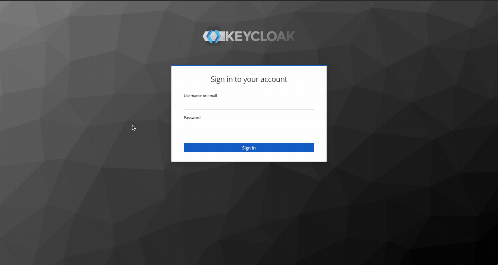

## Keycloak on k8s

This repo contains configuration files from the [article on running Keycloak on k8s](https://blog.brakmic.com/keycloak-with-postgresql-on-kubernetes/).

The following packages and tools have been used to setup the system:

* Keycloak
* PostgreSQL
* Kind
* Helm
* Kubernetes Dashboard

### Manual installation

To install everything by hand, use the YAMLs located [here](./deployments/manual/README.md).

### Helm installation

For Helm installation go [here](./deployments/helm/README.md).

### Kubernetes Dashboard installation

To install Kubernetes Dashboard use the scripts located [here](./kube_dashboard/README.md).

### LICENSE
[MIT](LICNSE.md)