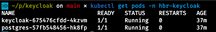
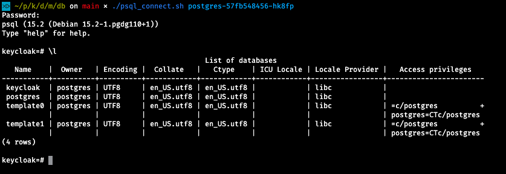

## Connect with Postgres DB within Kubernetes

* Query Postgres Pod with `kubectl get pods -n hbr-keycloak` (substitute your namespace if it differs)
  
  

* Use its name as parameter when calling `psql_connect.sh`

