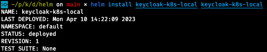

## Helm installation

* Install Helm first. This of course depends on your OS. Check [Helm docs](https://helm.sh/docs/intro/install/) for more info.
* Check predefined [values](./keycloak-k8s-local/values.yaml) in the Helm package directory of this project. Change them according to your preferences.
* Install deployments with `helm install keycloak-k8s-local keycloak-k8s-local`

* Check current status with `watch -n 1 kubectl get all -n hbr-keycloak` or via [Kubernetes Dashboard](../../kube_dashboard/README.md)
* Uninstall with `helm uninstall keycloak-k8s-local`