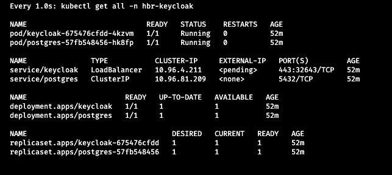

## Manual setup

* Apply the YAMLS in numerical order like: `kubectl apply -f 01_namespace.yaml -f 02_secrets.yml ...`
* Enter `watch -n 1 kubectl get all -n hbr-keycloak` to query the current state of deployments.

* Depending on your machine the deployment of all components will take a minute or two.
* Meanwhile, you could install the [Kubernetes Dashboard](../../kube_dashboard/README.md) to get a nice graphical overview of your k8s system.

**Hint**: most values and names in these YAMLs are hard-coded. For a more flexible variant, check the alternative [Helm installation](../helm/README.md).