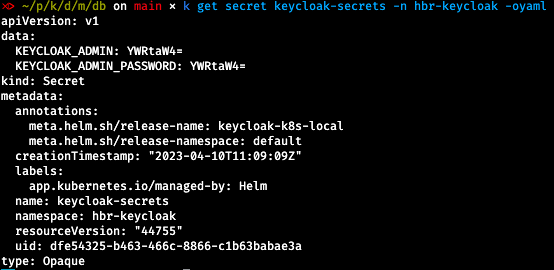

## Create TLS certs and keys for Ingress

* Use `create_tls_secret.sh` to generate a new [Secret](https://kubernetes.io/docs/concepts/configuration/secret/) of type TLS

**Hint**: this is not needed to run the demo as all needed Secrets get automatically created in [02_secrets.yml](../02_secrets.yml).

To read the contents of a Secret use kubectl, for example: `kubectl get secret keycloak-secrets -n hbr-keycloak -oyaml`

